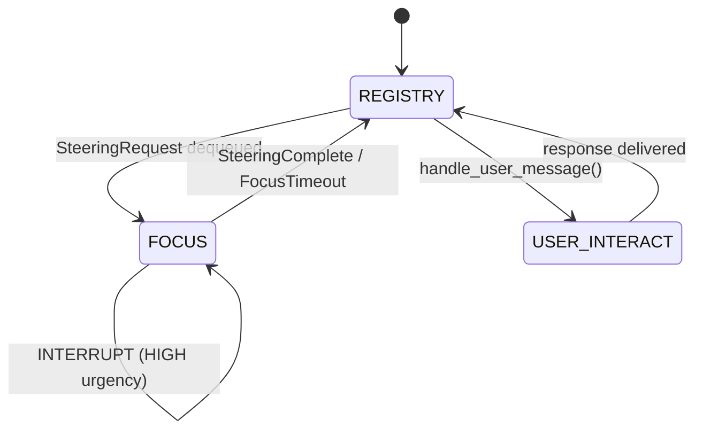

# Orchestrator

The DACS orchestrator — a REGISTRY / FOCUS / USER_INTERACT state machine.

!!! note "You usually don't need this"
    Use :class:`DACSRuntime` instead.  Access the orchestrator via
    `runtime.orchestrator` if you need to inspect state or call
    `handle_user_message()` directly.

::: dacs._orchestrator.Orchestrator
    options:
      show_source: true
      members:
        - __init__
        - run
        - stop
        - handle_user_message
        - register_agent
        - state
        - focus_agent_id

## OrchestratorState

::: dacs._orchestrator.OrchestratorState

## State machine diagram

## FOCUS context structure

When the orchestrator enters `FOCUS(aᵢ)`, the context prompt contains:

1. **System prompt** — role + instructions (from `ContextBuilder`)
2. **Agent task** — `aᵢ.task_description`
3. **Steering history** — all previous Q&A for `aᵢ`
4. **Recent output** — from the `SteeringRequest.relevant_context`
5. **Current question** — `SteeringRequest.question`
6. **Compressed registry** — compact entries for all other agents

The compressed registry uses 4-level priority to fit within the token budget:

1. Trim history fields
2. Shorten summaries
3. Drop summaries entirely
4. Raise `ContextBudgetError`
