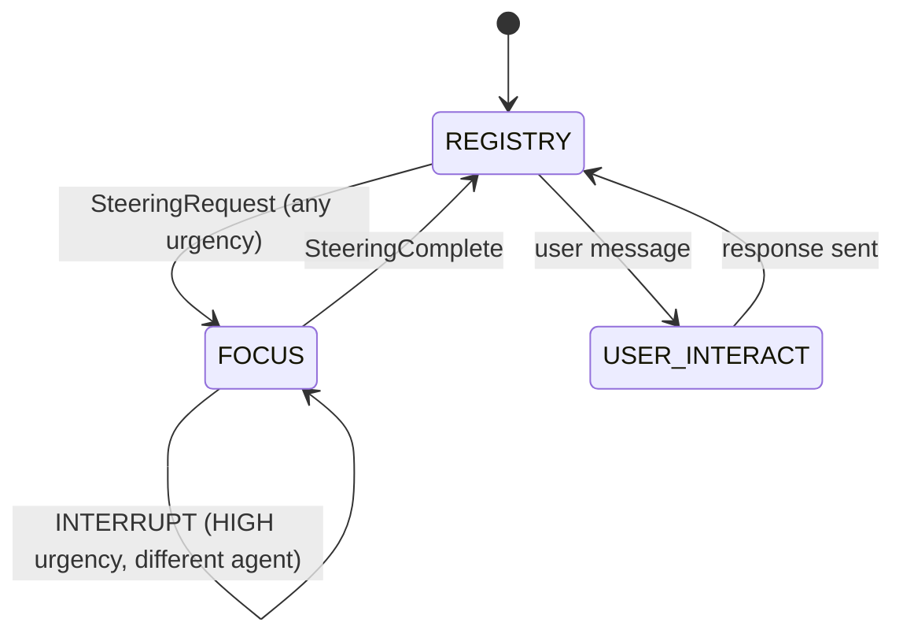

# DACS — Dynamic Attentional Context Scoping

> **Agent-triggered focus sessions for isolated per-agent steering in multi-agent LLM systems.**

DACS solves **context pollution** — the problem that arises when multiple agents all compete for space in a single orchestrator context window.  Traditional multi-agent systems concatenate every agent's state into one flat prompt.  As agent count grows, each agent's signals get diluted, steering accuracy drops, and token costs skyrocket.

DACS uses an **asymmetric, two-mode orchestrator**:

- **REGISTRY mode** — the orchestrator holds only a compact snapshot (≤ 200 tokens) per agent.
- **FOCUS(aᵢ) mode** — when agent *aᵢ* requests steering, the orchestrator loads *aᵢ*'s full context and a compressed view of all other agents.  It makes one isolated LLM call, then returns to REGISTRY.

The result: near-perfect steering accuracy at a fraction of the token cost.

---

## Quick benchmarks

| | DACS | Flat baseline |
|---|---|---|
| Steering accuracy | **90 – 98 %** | 21 – 60 % |
| Cross-agent contamination | **< 4 %** | 18 – 42 % |
| Context tokens at steering | **2–3.5× fewer** | baseline |

204 trials, 4 experiment phases, all p < 0.0001.

---

## Install

```bash
pip install dacs-agent
# with live terminal monitor:
pip install "dacs-agent[monitor]"
```

## 30-second example

```python
import asyncio
from dacs import DACSRuntime, BaseAgent, UrgencyLevel

class MyAgent(BaseAgent):
    async def _execute(self):
        self._push_update("Analysing input data")
        resp = await self._request_steering(
            context="Data has two possible schemas.",
            question="Use schema A or B?",
            urgency=UrgencyLevel.HIGH,
        )
        self._push_update(f"Proceeding with: {resp.response_text}")

async def main():
    async with DACSRuntime(model="claude-3-haiku-20240307", verbose=True) as rt:
        rt.add_agent(MyAgent(agent_id="analyst", task="Analyse and clean dataset"))
        await rt.run()

asyncio.run(main())
```

---

## State machine



---

## What's next?

- [Installation & Quick Start](quickstart.md)
- [Core Concepts](concepts.md)
- [Tutorials](tutorials/01_hello_dacs.md)
- [API Reference](api/runtime.md)
- [Benchmark Details](research/benchmarks.md)
