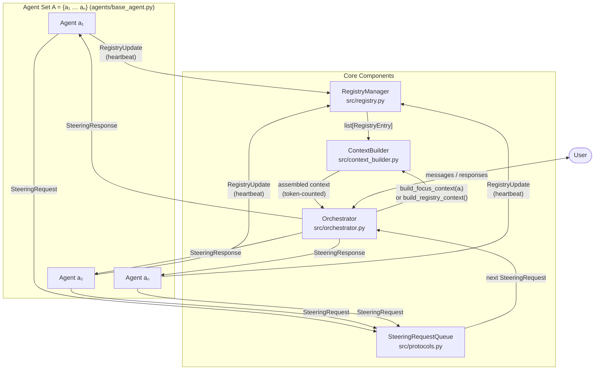
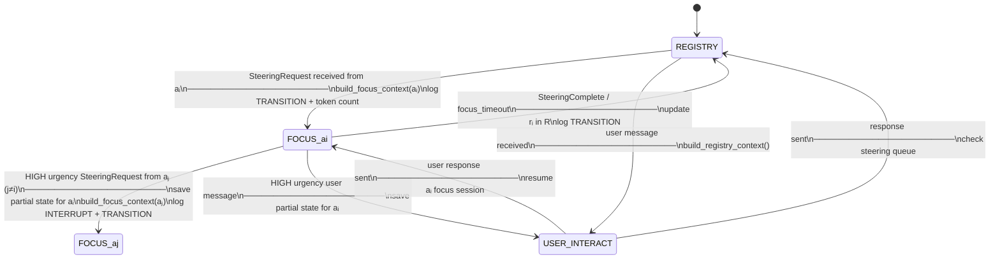
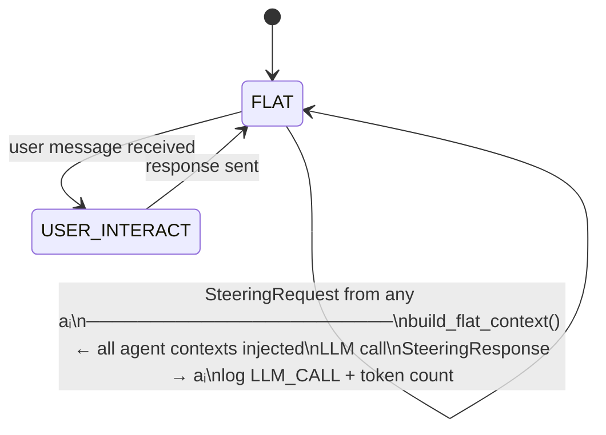

# DACS — Architecture Diagram

**Phase 2 Deliverable 1**  
**Last updated:** April 4, 2026

---

## Overview

DACS is implemented as four cooperating components. The orchestrator is a state machine with three modes: `REGISTRY`, `FOCUS(aᵢ)`, and `USER_INTERACT`. Context assembly is fully delegated to `ContextBuilder`, which is also the measurement point for all token-count logging. Agents communicate with the orchestrator through two channels: the `RegistryManager` (passive heartbeats) and the `SteeringRequestQueue` (active steering requests).

---

## Diagram 1 — DACS Component Graph

### Component summary

| Component | File | Responsibility |
|---|---|---|
| `RegistryManager` | `src/registry.py` | Single source of truth for all agent state. Thread-safe read/write for concurrent heartbeats. Enforces per-entry ≤200-token budget. |
| `SteeringRequestQueue` | `src/protocols.py` | Priority queue of pending `SteeringRequest` messages. HIGH urgency → front of queue. Exposes `has_high_urgency()` for interrupt checking. |
| `ContextBuilder` | `src/context_builder.py` | Deterministically assembles the exact token-counted context for every orchestrator LLM call. Central experiment measurement point. |
| `Orchestrator` | `src/orchestrator.py` | State machine + LLM call dispatch. Routes `SteeringResponse` back to the correct agent. Logs all state transitions. |

---

## Diagram 2 — Orchestrator State Machine

**State definitions:**

| State | Context window contents | Can interrupt? |
|---|---|---|
| `REGISTRY` | All `RegistryEntry` summaries (≤N×200 tokens) | Yes — any SteeringRequest |
| `FOCUS(aᵢ)` | `F(aᵢ)` + compressed registry (all others) | Only HIGH urgency from aⱼ≠aᵢ |
| `USER_INTERACT` | All `RegistryEntry` summaries (same as REGISTRY) | User message is the trigger |

---

## Diagram 3 — Baseline Orchestrator Overlay

The baseline uses the **same four components and same code paths**. The only difference: `focus_mode=False` in `Orchestrator.__init__()`. This disables `build_focus_context()` — replaced by `build_flat_context()` which concatenates all agent contexts into one. The `REGISTRY` and `FOCUS` states collapse into a single `FLAT` state.

**What changes in baseline mode:**

| | DACS | Baseline |
|---|---|---|
| Context at steering time | `F(aᵢ)` + compressed registry (~7k tokens for N=10) | All agent contexts concatenated (~47k tokens for N=10) |
| `ContextBuilder` method | `build_focus_context(aᵢ)` | `build_flat_context()` |
| Orchestrator states | REGISTRY / FOCUS / USER_INTERACT | FLAT / USER_INTERACT |
| Wrong-agent contamination risk | Low — aⱼ contexts compressed to summaries | High — full aⱼ contexts always present |
| Code path | Identical except the branch above | Identical except the branch above |

> The experiment measures DACS at ~7k tokens vs baseline at ~47k tokens for N=10. The gap is the result.

---

## Logging Map — Where Each Log Line Comes From

Every LLM call and state transition is logged. This table answers "which component produces which log event?" — designed here so the experiment harness can parse it deterministically.

| Log event | Produced by | Trigger |
|---|---|---|
| `REGISTRY_UPDATE` | `RegistryManager.update()` | Every agent heartbeat |
| `CONTEXT_BUILT` | `ContextBuilder.build_focus_context()` or `build_registry_context()` | Every context assembly before an LLM call |
| `TRANSITION` | `Orchestrator` on every state change | SteeringRequest received, SteeringComplete, user message, interrupt |
| `LLM_CALL` | `Orchestrator` after every LLM call | Completion of any LLM call |
| `STEERING_REQUEST` | `SteeringRequestQueue.enqueue()` | Every agent SteeringRequest |
| `STEERING_RESPONSE` | `Orchestrator` when routing response | After LLM call in FOCUS mode |
| `INTERRUPT` | `Orchestrator` on HIGH urgency interrupt | `has_high_urgency()` returns True during FOCUS |
| `FOCUS_TIMEOUT` | `Orchestrator` | focus_timeout exceeded |

**Experiment measurement mapping:**

| Experiment question | Answer from log |
|---|---|
| "What was the context size when aᵢ received steering?" | `CONTEXT_BUILT` log for that FOCUS session |
| "Did the orchestrator reference the wrong agent?" | NLP similarity on `STEERING_RESPONSE.response_text` vs `agent_id` |
| "How long did the user wait?" | `TRANSITION` timestamps from user message to response |
| "How many tokens did the baseline use?" | `CONTEXT_BUILT` log in baseline mode |
| "Did steering accuracy differ between DACS and baseline?" | `STEERING_RESPONSE.response_text` scored against ground truth |

---

## Component Descriptions

### RegistryManager (`src/registry.py`)

Maintains the single source of truth for all agent state. Every agent pushes a compact `RegistryUpdate` after each atomic step or status change (event-driven, not time-driven). `RegistryManager` enforces the ≤200-token-per-entry budget at write time — it truncates `last_output_summary` if needed and logs a warning, but never accepts silent over-budget entries. Reads are always from the current in-memory snapshot; no persistence is needed for the experiment. `mark_steering_pending()` and `mark_steering_complete()` are called by the Orchestrator to keep agent status synchronized with the steering queue.

### SteeringRequestQueue (`src/protocols.py`)

A priority queue where HIGH urgency requests jump to the front. The Orchestrator calls `peek()` before each LLM call to decide whether to stay in current state or transition. `has_high_urgency()` is checked after every LLM call completion to detect interrupt conditions. The queue also defines the `SteeringRequest` and `SteeringResponse` dataclasses — the formal message contract between agents and orchestrator. `request_id` (UUID) links each response to its originating request, enabling unambiguous log correlation.

### ContextBuilder (`src/context_builder.py`)

The central experiment variable. Every byte that enters an LLM call passes through `ContextBuilder`. It counts tokens before assembly using `tiktoken` (cl100k_base, deterministic, no GPU required) and raises `ContextBudgetError` if the assembled context would exceed `T`. There are two assembly paths: `build_focus_context(aᵢ)` for DACS focus sessions and `build_registry_context()` for REGISTRY/USER_INTERACT states. In baseline mode, `build_flat_context()` is used instead. Every call logs the mode, target agent, and exact token count — this is the primary measurement data for the paper.

### Orchestrator (`src/orchestrator.py`)

The state machine and LLM call dispatcher. On each iteration of the main `run()` loop: check `SteeringRequestQueue`, assemble context via `ContextBuilder`, make one LLM call, route the response, check for HIGH-urgency interrupts, repeat. User messages are handled via `handle_user_message()` which can preempt a focus session if urgency is HIGH. `focus_mode=False` disables the FOCUS state entirely, converting the orchestrator to the flat-context baseline with identical logging so results are directly comparable. Every state transition and LLM call is logged with timestamps and token counts.
