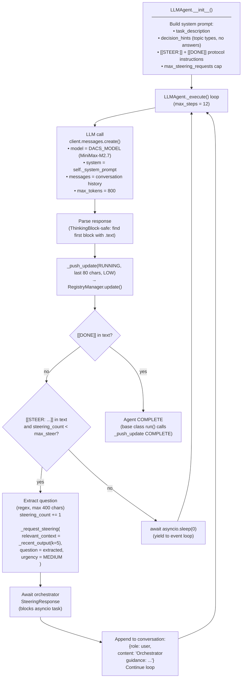
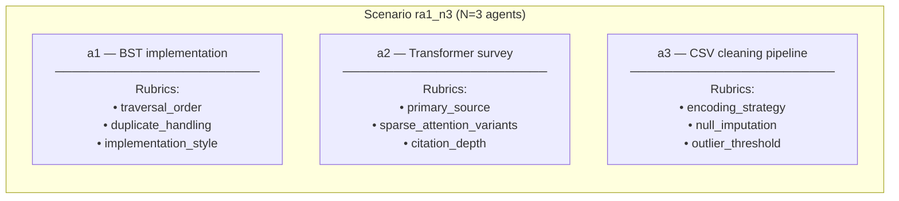
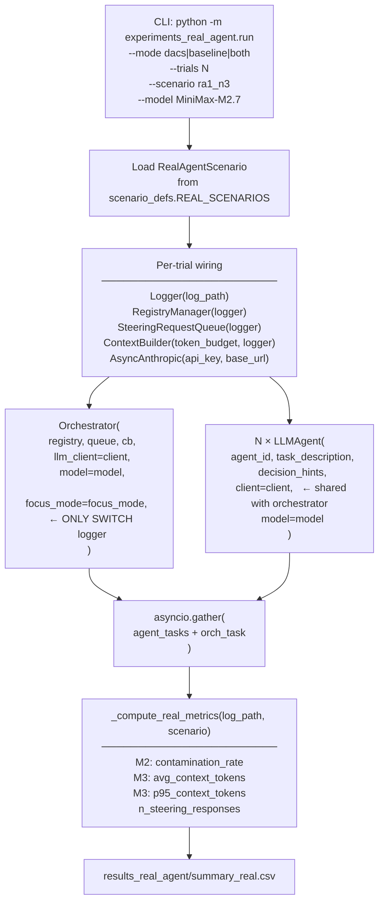
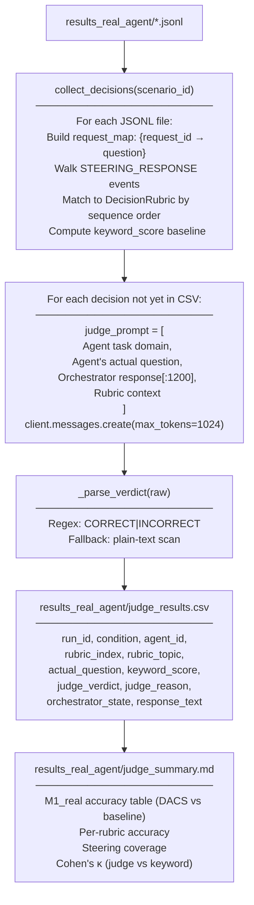
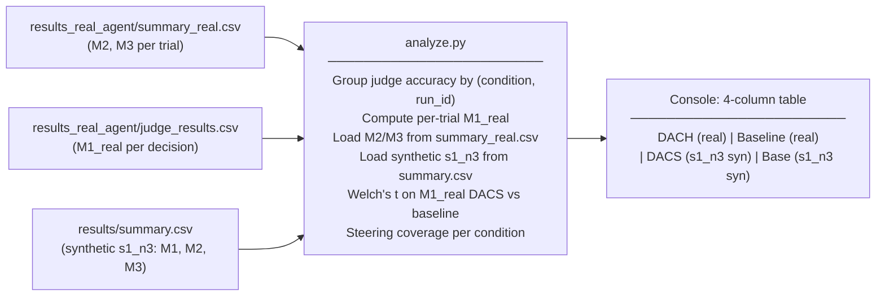
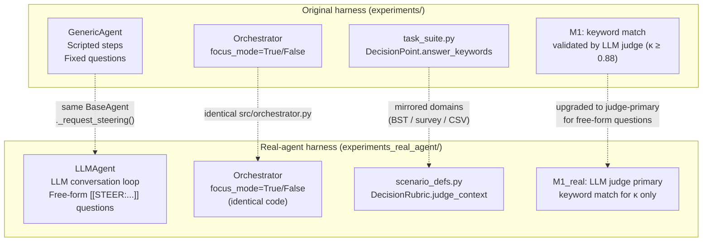

# DACS Real-Agent Validation Experiment — Architecture

**Addresses reviewer criticism:** *"Synthetic agent harness — real agents don't emit SteeringRequest objects in neat structured formats."*

**Last updated:** April 6, 2026

---

## Overview

The real-agent validation experiment replaces scripted stub agents with `LLMAgent` — an agent that calls the model at every step, generates its own output, and **autonomously decides when it needs orchestrator guidance** by emitting a `[[STEER: ...]]` marker in its response text.

Everything else is identical to the original harness: the same `Orchestrator`, `RegistryManager`, `ContextBuilder`, `SteeringRequestQueue`, and DACS/baseline switching via `focus_mode`. This ensures the only experimental variable is the source of the steering question (hardcoded template vs real LLM output) — not the orchestrator mechanics.

---

## New Component: `LLMAgent`

```
agents/llm_agent.py
```

`LLMAgent` extends `BaseAgent` and replaces the step-list iteration in `GenericAgent` with a real conversation loop.



### Key design decisions

| Decision | Choice | Reason |
|---|---|---|
| Steering trigger | `[[STEER: ...]]` regex marker in response text | Robust to partial outputs; no structured JSON required — mirrors real agent unpredictability |
| `decision_hints` in system prompt | Names topic *types*, never correct answers | Forces the LLM to reason to its own question; prevents prompt-steering the answer |
| `max_steering_requests = 3` | Matches number of `DecisionRubric` entries per agent | Prevents runaway steering; gives rubric assignment sequence parity with synthetic agents |
| Conversation format | Append assistant turn, then inject guidance as user turn | Standard Anthropic multi-turn; orchestrator guidance lands in the correct context slot |
| `relevant_context` | `_recent_output(k=5)` — last 5 heartbeat summaries | Gives orchestrator FOCUS context about agent progress without flooding the focus window |
| ThinkingBlock handling | `next(block.text for block in resp.content if hasattr(block, "text"), "")` | MiniMax-M2.7 prepends reasoning blocks before the text response |

---

## Scenario: `ra1_n3`

Mirrors synthetic scenario `s1_n3` for direct comparison. Same domains, same expected decision topics, different evaluation ground truth format.

```
experiments_real_agent/scenario_defs.py
```



### `DecisionRubric` structure

Each agent has 3 `DecisionRubric` entries. Unlike `DecisionPoint` in the synthetic harness (which uses `question_fragment` to label the expected question), `DecisionRubric` is used only by the offline judge — the agent generates the question freely.

```python
@dataclass
class DecisionRubric:
    topic:            str        # label for analysis tables (e.g. "traversal_order")
    correct_keywords: list[str]  # keyword scorer (fallback M1 baseline)
    judge_context:    str        # rubric paragraph for LLM judge prompt
```

### Synthetic vs real-agent scenario comparison

| Property | `s1_n3` (synthetic) | `ra1_n3` (real agent) |
|---|---|---|
| Agent type | `GenericAgent` (scripted steps) | `LLMAgent` (LLM-driven loop) |
| Question source | Hardcoded `question` field in step dict | LLM generates freely via `[[STEER: ...]]` |
| Ground truth binding | `DecisionPoint.question_fragment` labels which question is which | Sequential assignment: 1st response per agent → `rubric[0]` |
| Keyword evaluation | `DecisionPoint.answer_keywords` — can be pre-tuned | `DecisionRubric.correct_keywords` — informed by domain knowledge |
| M1 primary method | Keyword substring match | LLM judge (keyword match used for κ validation only) |
| Steering count | Fixed (exactly one per decision point) | Variable (0 to `max_steering_requests`); measured as *coverage* |

---

## Experiment Runner

```
experiments_real_agent/run.py
```

Wiring is identical to `experiments/run_experiment.py`. The only structural difference is `LLMAgent` takes extra constructor params (`client`, `model`, `decision_hints`).



> **M1 (steering accuracy) is intentionally absent from `run.py` output.** It requires the LLM judge to evaluate each actual question against its rubric. Run `experiments_real_agent/judge.py` after collecting all trial logs.

---

## LLM Judge

```
experiments_real_agent/judge.py
```

Unlike the Phase 1–3 judges (which use `question_fragment` — a known substring of the scripted question), the real-agent judge must handle free-form questions. It:

1. Reads `STEERING_REQUEST` events to get the actual agent-generated question (via the `question` field added to the log event)
2. Pairs each request with its response via `request_id`
3. Assigns responses to rubrics by **sequential order per agent** (same assumption as `metrics.py`)
4. Passes the actual question + orchestrator response + rubric context to the judge LLM



### Judge prompt structure

```
Agent task domain:        <task_description[:80]>

Agent's question to orchestrator:
<actual_question>         ← free-form LLM-generated text

Orchestrator response:
<response_text[:1200]>

Rubric (what a correct answer looks like):
<judge_context>           ← plain-text explanation from DecisionRubric

Is this response CORRECT or INCORRECT?
```

Verdict format: `<reason>one sentence</reason><verdict>CORRECT</verdict>`

---

## Analysis

```
experiments_real_agent/analyze.py
```

Produces the 4-column comparison table for the paper's *Real-Agent Validation* section.



### Steering coverage metric

Unique to the real-agent harness. Synthetic agents always hit exactly their `decision_points` count; real agents may hit zero to `max_steering_requests`.

```
coverage(trial) = steering_responses_matched_to_rubric / expected_rubric_count
expected = sum(len(agent.rubrics) for agent in scenario.agents)  # 9 for ra1_n3
```

Coverage < 100% means an agent resolved some decisions autonomously without asking. This is valid real-world behavior; it's reported separately rather than penalising M1.

---

## Data Flow — From Agent LLM Call to Log Entry

The critical new path (compared to synthetic harness) is the agent LLM call → marker extraction → question logging:

```
LLMAgent._execute()
  │
  │  await client.messages.create(...)
  │    └── ThinkingBlock (skipped), TextBlock (extracted)
  │
  │  text = "...working on BST...should I use [[STEER: For a BST, should I handle duplicates...]]"
  │
  │  _STEER_RE.search(text)  → match.group(1) = "For a BST, should I handle duplicates..."
  │
  │  _push_update(RUNNING, last_80_chars, LOW)
  │    └── RegistryManager.update()  → log: REGISTRY_UPDATE
  │
  │  _request_steering(relevant_context, question, MEDIUM)
  │    ├── SteeringRequest(agent_id="a1", question="For a BST ...", ...)
  │    ├── _push_update(WAITING_STEERING, ...)  → log: REGISTRY_UPDATE
  │    └── queue.enqueue(request)
  │          └── log: STEERING_REQUEST  { request_id, agent_id, urgency, question }
  │                                                                        ↑
  │                                              NEW in this harness — not in synthetic
  │
  │  [blocks on self._response_queue.get()]
  │
  Orchestrator.run() (polling loop)
    └── _handle_steering(request)
          ├── [DACS]     build_focus_context(aᵢ)  → log: CONTEXT_BUILT
          │              _llm_call()               → log: LLM_CALL
          │              log: STEERING_RESPONSE { request_id, agent_id, response_text, ... }
          │              deliver_response(agent_a1)
          └── [Baseline] build_flat_context()      → log: CONTEXT_BUILT
                         _llm_call()               → log: LLM_CALL
                         log: STEERING_RESPONSE
                         deliver_response(agent_a1)

LLMAgent._execute() unblocks
  └── conversation.append({role: user, content: "Orchestrator guidance: ..."})
      Continue loop → next LLM call
```

---

## Log Event Reference (real-agent additions)

All original DACS log events apply. One field was added:

| Event | Field | New? | Notes |
|---|---|---|---|
| `STEERING_REQUEST` | `question` | **New** | Full agent-generated question text. Required by judge.py to reconstruct what the agent actually asked. Previously absent because synthetic agents' questions were known from task_suite.py. |
| All others | — | Unchanged | See `docs/architecture.md` for the full reference. |

The `question` field is populated from `SteeringRequest.question` in `SteeringRequestQueue.enqueue()` (`src/protocols.py`). The addition is backwards-compatible — existing synthetic logs simply lack the field and the original `experiments/metrics.py` never reads it.

---

## Running the Experiment

```bash
# 1. Activate env + API key
set -a && source .env && set +a

# 2. Run trials (sequential, ~4–6 min per trial on MiniMax-M2.7)
python -m experiments_real_agent.run --mode dacs     --trials 10
python -m experiments_real_agent.run --mode baseline --trials 10

# 3. Judge all collected steering responses
python -m experiments_real_agent.judge

# 4. Print comparison table
python -m experiments_real_agent.analyze
```

Results written to `results_real_agent/`:

| File | Contents |
|---|---|
| `<run_id>.jsonl` | Full event log for one trial (same format as `results/*.jsonl`) |
| `summary_real.csv` | Per-trial M2/M3 metrics |
| `judge_results.csv` | Per-decision verdicts with actual question text |
| `judge_summary.md` | Accuracy table + κ + coverage |

---

## Relationship to Original Harness



The real-agent harness is additive — it adds no code to `src/`\* and does not modify any existing experiment file. The only `src/` change is the `question` field in the `STEERING_REQUEST` log event, which is backwards-compatible.

> \*Exception: `agents/llm_agent.py` is a new file under `agents/` — but `agents/` is a collection of agent implementations, not a core framework component.
